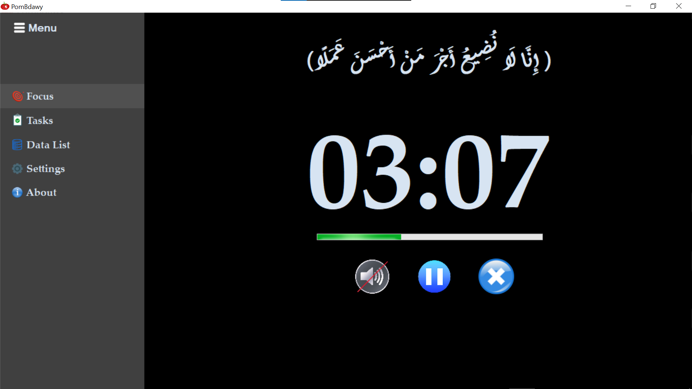
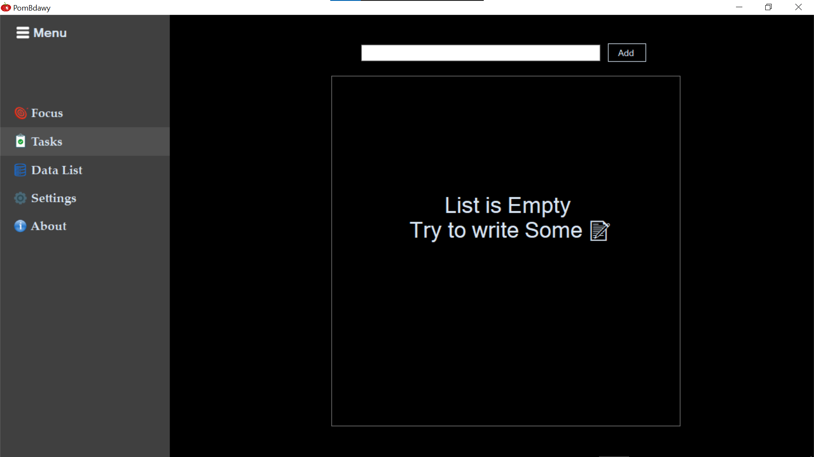
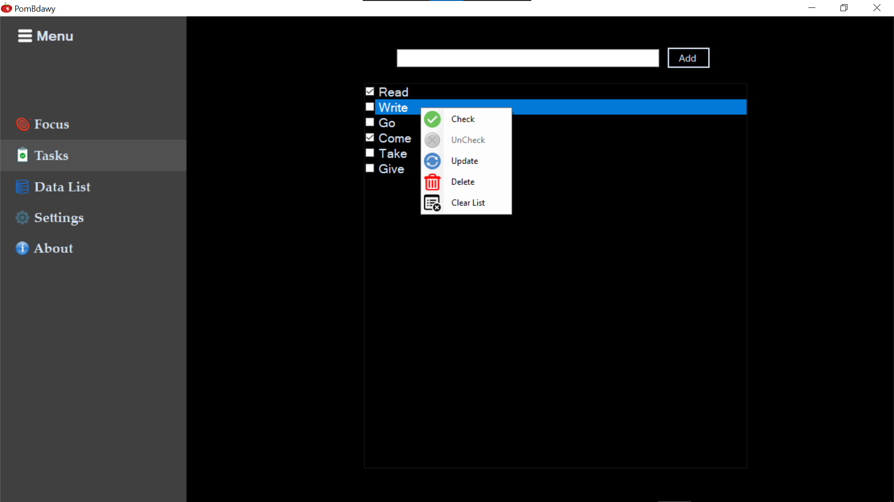
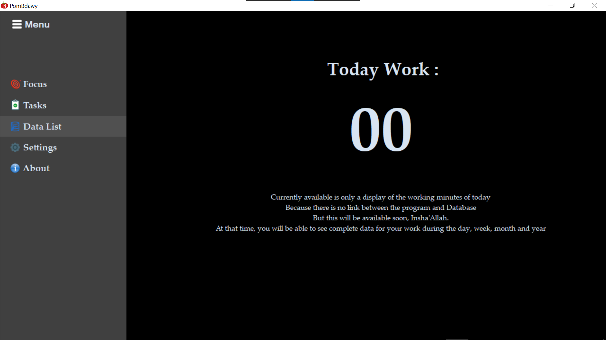
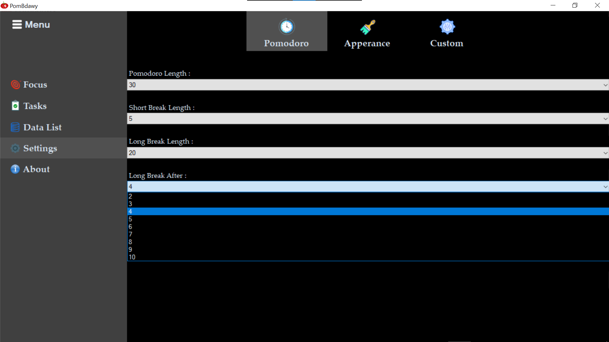

#  PomBdawy  

PomBdawy is a Pomodoro timer application that helps you stay focused and manage your time effectively using the Pomodoro Technique. 
This app allows you to set work and break intervals, track progress, and maintain a productive workflow.

## Features

- **Pomodoro Timer**: Set a timer for focused work intervals.
- **Break Timer**: Automatic breaks after each Pomodoro session.
- **Customizable Settings**: Customize the Colors, Fonts and Backgrounds.
- **Task Tracking**: Write your tasks and Keep track of them and progress.

## Installation

   - [Download PomBdawy Setup](your-download-link)

## Usage

1. **Launch PomBdawy**: After installation, open the application from the start menu or desktop shortcut.
2. **Configure Settings**: Set your work and break intervals by going to the settings tab.
3. **Start Timer**: Click on the **Play(▶)** button to begin your Pomodoro session. The timer will count down the work interval, and you will receive an alert when it's time for a break.
4. **Track Your Progress**: Use the task section to keep track of your work and accomplishments.

## Features and Customization in every screen 

# Focus Screeen 🖥
- here you can see inspiration message
- start & end interval
- track your work and break timer
- mute timer sound 

# Tasks Screeen 🖥
- here you can manage your tasks
- (Add,Delete,Update) tasks
- Clear List

# List Screeen 🖥
- here you can Track your work log
- now there is no database but it will be available soon insha' Allah

# Settings Screeen 🖥
there are three sections in settings screen (Pomodoro, Apperance, Custom)
**  Pomodoro 🖥**
- here you can control all timer length as it appear in the next image

** Apperance**
  - here you can control all timer length as it appear in the next image

- **Work Interval**: Set your desired work time (default: 25 minutes).
- **Break Interval**: Set your desired break time (default: 5 minutes).
- **Task List**: Add tasks you want to complete and track your progress.
- **Sound Alerts**: You can enable or disable sound alerts for work and break sessions.

## Technologies Used

- **C#** with **Windows Forms**
- **.NET Framework 4.7.2**
- **Timer Logic** based on the **Pomodoro Technique**

## Contributing

If you'd like to contribute to PomBdawy, feel free to fork the repository and submit a pull request. Please follow the contribution guidelines for any changes you wish to make.

## License

This project is open-source and available under the [MIT License](LICENSE).

## Contact

If you have any questions or feedback, feel free to reach out:

- **Author**: Badawy Ahmed
- **Email**: [your-email@example.com]
- **GitHub**: [https://github.com/your-github-username](https://github.com/your-github-username)

---

Thank you for using PomBdawy! We hope it helps you stay productive and focused.
