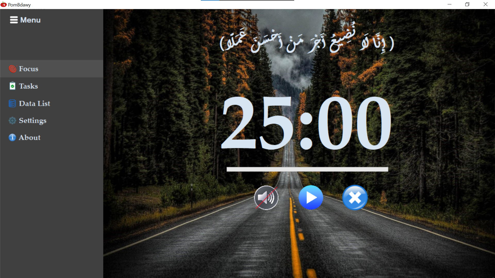
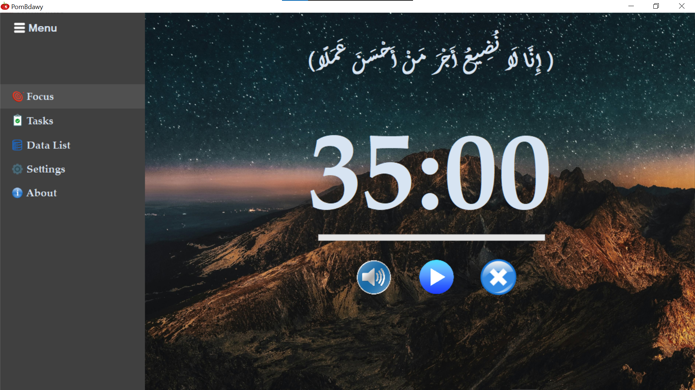
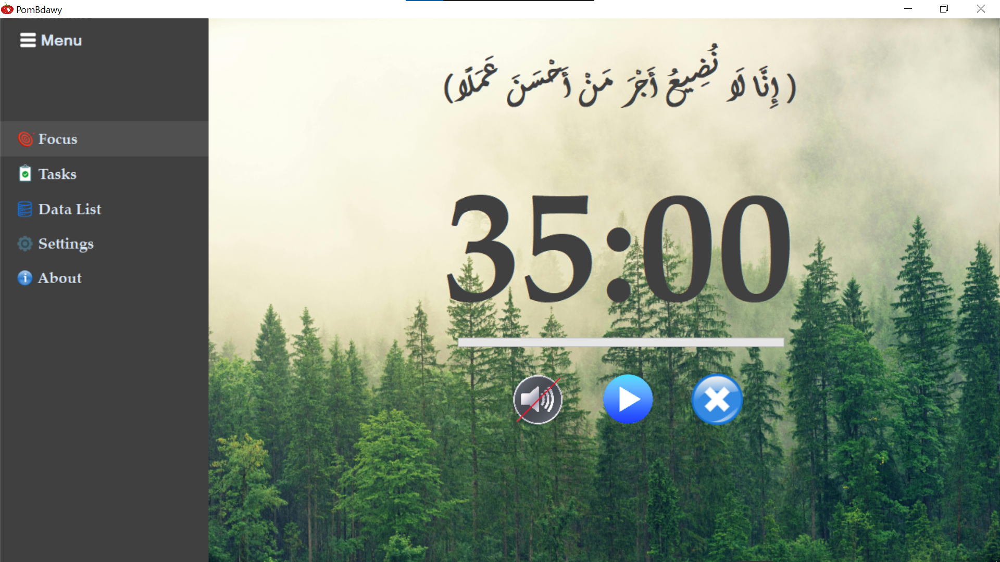
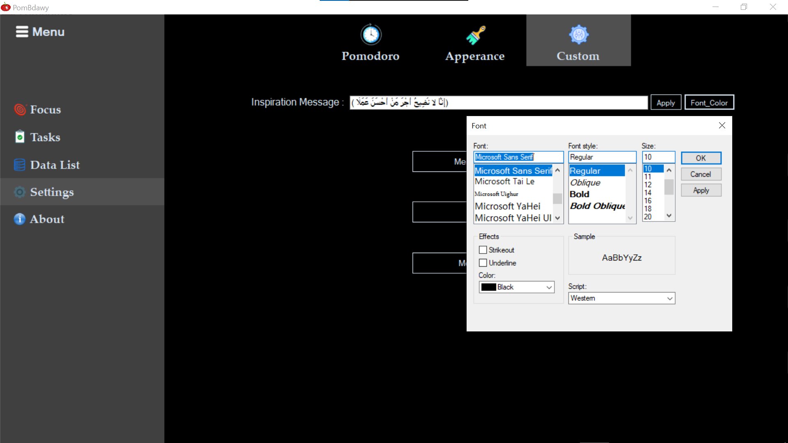

#  PomBdawy  

PomBdawy is a Pomodoro timer application that helps you stay focused and manage your time effectively using the Pomodoro Technique. 
This app allows you to set work and break intervals, track progress, and maintain a productive workflow.

##  Features

- **Pomodoro Timer**: Set a timer for focused work intervals.
- **Break Timer**: Automatic breaks after each Pomodoro session.
- **Customizable Settings**: Customize the Colors, Fonts and Backgrounds.
- **Task Tracking**: Write your tasks and Keep track of them and progress.

##  Installation

   - [Download PomBdawy Setup](https://github.com/bdawyv7/pombdawy/releases) 

##  Usage

1. **Launch PomBdawy**: After installation, open the application from the start menu or desktop shortcut.
2. **Configure Settings**: Set your work and break intervals by going to the settings tab.
3. **Start Timer**: Click on the **Play(▶)** button to begin your Pomodoro session. 
 The timer will count down the work interval, and you will receive an alert when it's time for a break.
4. **Track Your Progress**: Use the task section to keep track of your work and accomplishments.

#  Features and Customization in every screen   Focus Screeen 🖥
- here you can see inspiration message
- start & end interval
- track your work and break timer
- On/Off timer sound 

#  Tasks Screeen 🖥
- Manage your tasks
- (Add,Delete,Update) tasks
- Clear List

#  Data List Screeen 🖥
- Track your work log
- Now there is no database but it will be available soon insha' Allah

#  Settings Screeen 🖥
There are three sections in settings screen (Pomodoro, Apperance, Custom)

** Pomodoro 🖥**
- Control all timer lengths :
- **Pomodoro length**: Set your desired work time (default: 30 minutes).
- **short break length**: Set your desired short break time (default: 5 minutes).
- **long break length**: Set your desired long break time (default: 20 minutes).
- **long break after**: Set your desired break after how many intervals (default: 4 intervals).

**  Apperance 🖥**
- Change Timer Background : there are 8 backgrounds you can choose from them 

  
  
  

- On/Off Timer sound
- On/Off Dark mode
- On/Off inspiration message show

**  Custom 🖥**
- Change inspiration message (text, font, color)
- change timer, message color 
- Change menu background color
- change menu font color

#  About Screeen 🖥
- Some info about developer and His social Accounts

#  Notifications🔔
- Receive notification for work time

- Receive notification for short break

- Receive notification for long break

## Technologies Used

- **C#** with **Windows Forms**
- **.NET Framework 4.7.2**
- **Timer Logic** based on the **Pomodoro Technique**

## Contact

If you have any questions or feedback, feel free to reach out:

- **Author**: Bdawy Ahmed
- [LinkedIn](https://www.linkedin.com/in/bdawyv7/)
- [Telegram](https://t.me/bdawyv7)

---

Thank you for using PomBdawy! We hope it helps you stay productive and focused.
